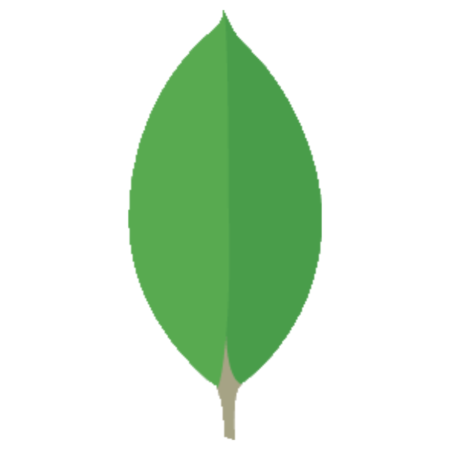
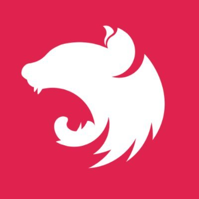

## Hi there 👋

I am a 36 yo self-taught web developer still looking for my first job in this industry.\
I started to learn from the beginning of 2020 going through HTML, CSS to programming languages like JS, TS and to frameworks based on those, both on the frontend and the backend, where I finally ended up being able to build and develop full-stack applications just by myself.

As I'm passionate about blockchain technology, cryptocurrencies, metaverse, decentralisation and whole the web3 world I also learnt myself Solidity to be able to build DApps as well and participate in this decentralised evolution of internet.

##

:gem: I'm currently open for any opportunities where I can earn some professional, teamwork experiences.\
:star2: Go ahead, visit my website and tell me what you think: https://blackh3art.dev/ \
:notebook: Maybe you'll find there some interesting blog posts about web3!\
:mailbox: Feel free to contact me! Always pleasure to meet new people.

### Contact with me:
 &nbsp;
 &nbsp;

## TECH STACK
### Languages

  
  
  

### Frontend

  
  
  
  

### Backend

  
  
  
  
  
  

### Blockchain

### Languages and tools
&nbsp;
&nbsp;
&nbsp;
&nbsp;
&nbsp;
&nbsp;
&nbsp;
&nbsp;
&nbsp;
&nbsp;
&nbsp;
&nbsp;
&nbsp;
&nbsp;

<!--
**BlackH3art/BlackH3art** is a ✨ _special_ ✨ repository because its `README.md` (this file) appears on your GitHub profile.

Here are some ideas to get you started:

- 🔭 I’m currently working on ...
- 🌱 I’m currently learning ...
- 👯 I’m looking to collaborate on ...
- 🤔 I’m looking for help with ...
- 💬 Ask me about ...
- 📫 How to reach me: ...
- 😄 Pronouns: ...
- ⚡ Fun fact: ...
-->

